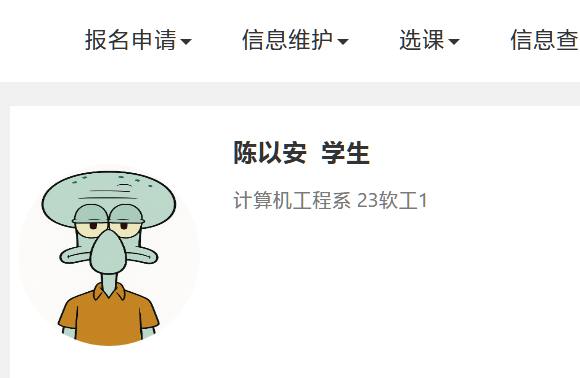
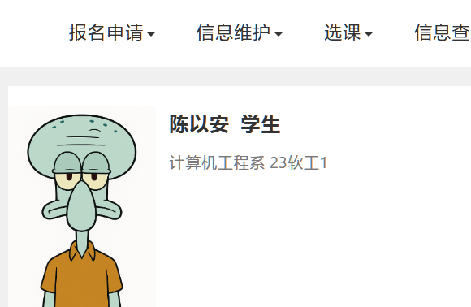

# 正方教务系统首页证件照优化

|     脚本关闭时      |     脚本开启时      |
| :-----------------: | :-----------------: |
|  |  |

## 简介

本脚本旨在优化正方教务管理系统首页的证件照显示效果。启用后，首页展示的证件照将由入学后拍摄的证件照自动替换为入学前上传的证件照。同时，脚本还会去除证件照的圆角和边距，并恢复证件照的原始宽高比例，使照片显示更加自然、真实。

## 使用方法

1. 首先在浏览器中安装 [Tampermonkey](https://www.tampermonkey.net/) 插件。
2. 接着在 Tampermonkey 中安装 [ZFImageOptimize](https://greasyfork.org/scripts/498142) 脚本。
3. 安装完成后，访问教务系统首页即可自动体验优化效果，无需其他操作。

## 功能介绍

### 1. 证件照替换为入学前照片

脚本会自动将首页的证件照由系统默认的入学后照片，替换为入学前用户自主上传的证件照。通常情况下，入学前的证件照由本人自行上传，照片质量和观感普遍更佳。

### 2. 恢复证件照原始宽高比例

原有的证件照显示为正方形，导致人物形象被压缩变形。脚本会自动恢复证件照的原始宽高比例，确保照片人物比例自然，视觉效果更加和谐。

### 3. 去除证件照圆角

为保证证件照边缘的严谨和正规，脚本会将证件照的圆角效果去除，使其保持原本的直角边框，更符合证件照的标准规范。

### 4. 去除证件照边距

脚本会自动清除证件照四周多余的边距，使照片与页面布局更为紧密贴合，整体观感更加整洁美观。

## 许可证

`Copyright © 2025 NianBroken. All rights reserved.`

本项目采用 [Apache-2.0](https://www.apache.org/licenses/LICENSE-2.0 "Apache-2.0") 许可证。简而言之，你可以自由使用、修改和分享本项目的代码，但前提是在其衍生作品中必须保留原始许可证和版权信息，并且必须以相同的许可证发布所有修改过的代码。

## 其他

欢迎提交 `Issues` 和 `Pull requests`